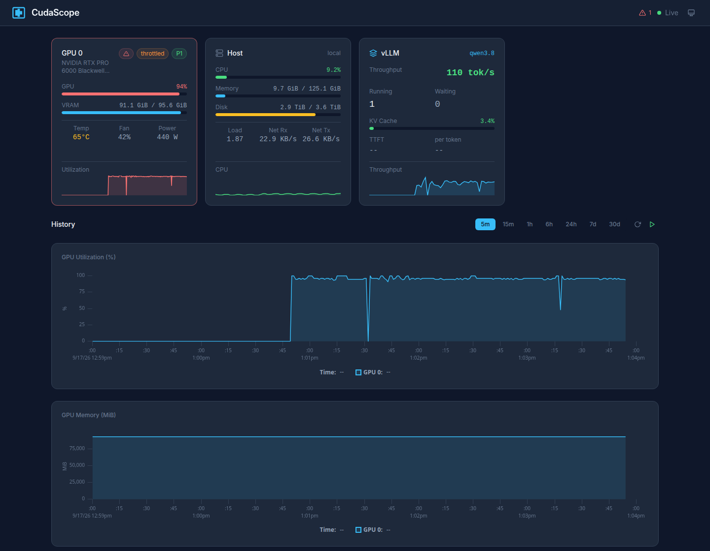
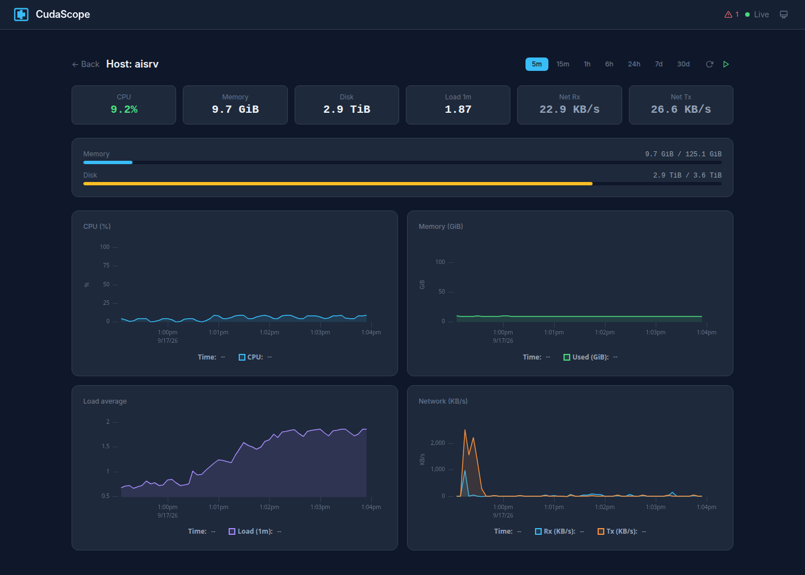
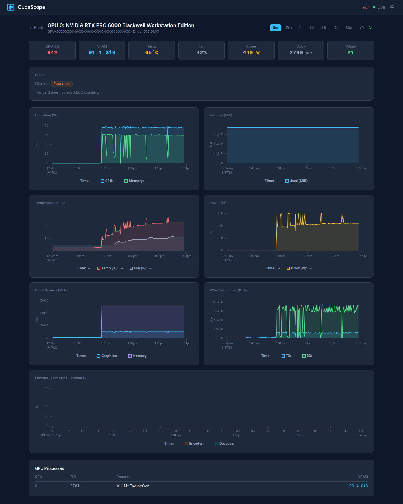
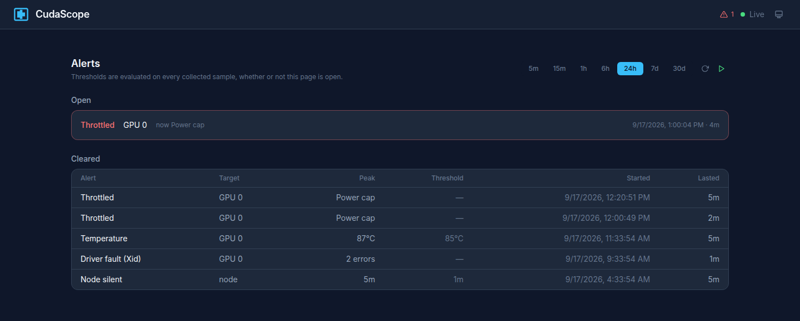

# CudaScope

Lightweight, self-hosted NVIDIA GPU monitoring with real-time dashboards and historical metrics.

```bash
docker run -d --gpus all --pid=host -p 9090:9090 -v cudascope-data:/data ssubbotin/cudascope
```

Then open [http://localhost:9090](http://localhost:9090).



- **Direct NVML access** via [go-nvml](https://github.com/NVIDIA/go-nvml) - no nvidia-smi parsing
- **Throttle reasons, ECC counters and Xid faults** - why a card slowed down, and when the driver reported a fault
- **vLLM integration** - scrapes vLLM `/metrics` for tok/s, KV cache, latency, active model
- **Ollama integration** - which model is loaded, how much of it fits in VRAM, when it unloads
- **Embedded storage** - SQLite with automatic rollup retention (raw 1s -> 1m -> 1h)
- **Single binary** - Go backend with embedded Svelte 5 SPA (go:embed)
- **Zero dependencies** - no Prometheus, no Grafana, no InfluxDB
- **Multi-node** - Docker Swarm support with agent/hub architecture

## Prerequisites

Docker with GPU access requires the [NVIDIA Container Toolkit](https://docs.nvidia.com/datacenter/cloud-native/container-toolkit/latest/install-guide.html) installed on the host.

## Quick Start

### Standalone (single host)

```bash
docker run -d --gpus all --pid=host -p 9090:9090 -v cudascope-data:/data ssubbotin/cudascope
```

`--pid=host` is what fills the process list. NVML reports GPU processes by
their host PID, and a container with a PID namespace of its own gets an empty
list back without an error: the dashboard shows a busy GPU with nothing running
on it, and the log says nothing. The Compose file sets the same thing as
`pid: host`.

Or with Compose:

```bash
docker compose up -d
```

### Docker Swarm (multi-node GPU cluster)

Label your GPU nodes:

```bash
docker node update --label-add gpu=true <node-name>
```

Deploy the stack:

```bash
docker stack deploy -c docker-stack.yml cudascope
```

This deploys an **agent** on every GPU node (global mode) and a single **hub** on the manager node.

## Configuration

All settings via environment variables or CLI flags:

| Variable | Flag | Default | Description |
|----------|------|---------|-------------|
| `CUDASCOPE_MODE` | `--mode` | `standalone` | `standalone`, `hub`, or `agent` |
| `CUDASCOPE_PORT` | `--port` | `9090` | HTTP listen port |
| `CUDASCOPE_DATA_DIR` | `--data-dir` | `/data` | SQLite database location |
| `CUDASCOPE_HUB_URL` | `--hub-url` | - | Hub URL (agent mode only) |
| `CUDASCOPE_NODE_ID` | `--node-id` | hostname | Node identifier for multi-node |
| `CUDASCOPE_COLLECT_INTERVAL` | `--collect-interval` | `1s` | GPU metric collection interval |
| `CUDASCOPE_HOST_INTERVAL` | `--host-interval` | `5s` | Host metric collection interval |
| `CUDASCOPE_PROCESS_INTERVAL` | `--process-interval` | `5s` | GPU process list collection interval |
| `CUDASCOPE_COLLECT_STALE_AFTER` | `--collect-stale-after` | `1m` | Standalone only. `/api/v1/healthz` fails once collection is older than this (0 disables) |
| `CUDASCOPE_COLLECT_STALL_EXIT_AFTER` | `--collect-stall-exit-after` | `5m` | Standalone only. Exit once collection is older than this, so the supervisor restarts the process (0 disables) |
| `CUDASCOPE_RETENTION_RAW` | `--retention-raw` | `24h` | Raw metrics retention |
| `CUDASCOPE_RETENTION_1M` | `--retention-1m` | `720h` | 1-minute rollup retention (30d) |
| `CUDASCOPE_RETENTION_1H` | `--retention-1h` | `8760h` | 1-hour rollup retention (365d) |
| `CUDASCOPE_MAX_POINTS` | `--max-points` | `2000` | Most points one history response carries (0 disables the cap) |
| `CUDASCOPE_AUTH` | `--auth` | - | Basic auth `user:password` |
| `CUDASCOPE_INGEST_TOKEN` | `--ingest-token` | - | Secret agents present to a hub when pushing metrics |
| `CUDASCOPE_CORS_ORIGIN` | `--cors-origin` | - | Origin allowed to call the API from another site |
| `CUDASCOPE_VLLM_URL` | `--vllm-url` | - | vLLM endpoint URL (e.g. `http://localhost:8000`) |
| `CUDASCOPE_VLLM_INTERVAL` | `--vllm-interval` | `5s` | vLLM metrics scrape interval |
| `CUDASCOPE_OLLAMA_URL` | `--ollama-url` | - | ollama base URL (e.g. `http://localhost:11434`) |
| `CUDASCOPE_OLLAMA_INTERVAL` | `--ollama-interval` | `10s` | ollama poll interval |
| `CUDASCOPE_ALERT_TEMP` | `--alert-temp` | `0` | Temperature alert threshold (C) |
| `CUDASCOPE_ALERT_GPU_UTIL` | `--alert-gpu-util` | `0` | GPU utilization alert (%) |
| `CUDASCOPE_ALERT_MEM_UTIL` | `--alert-mem-util` | `0` | Memory utilization alert (%) |
| `CUDASCOPE_ALERT_THROTTLE` | `--alert-throttle` | `true` | Record the stretches a card holds its own clocks back |
| `CUDASCOPE_ALERT_FOR` | `--alert-for` | `30s` | How long a threshold must be exceeded before an alert opens |
| `CUDASCOPE_ALERT_CLEAR` | `--alert-clear` | `1m` | How long a metric must be normal again before an alert closes |
| `CUDASCOPE_NODE_OFFLINE_AFTER` | `--node-offline-after` | `1m` | Silence after which a node counts as offline and raises an alert |
| `CUDASCOPE_RETENTION_ALERTS` | `--retention-alerts` | `2160h` | Closed alert event retention (90d) |

Alert thresholds of `0` mean disabled. An empty vLLM or ollama URL means disabled.

## Features

### Dashboard

- Per-GPU cards with real-time utilization, VRAM, temperature, fan, power, sparklines
- Host card with CPU, RAM, disk, network
- **vLLM card** with token throughput (tok/s), active/waiting requests, KV cache usage, latency, model name
- **Ollama card** with the loaded model, its share of VRAM, and the keep alive countdown
- Multi-GPU overlay charts (utilization, memory)
- Host CPU and RAM history charts
- GPU process list with VRAM usage and each process's command line, so a
  card running three jobs called `python` says which is which

Command lines are masked where they are read, before they are stored or sent
to a hub: the value after an argument whose name contains `key`, `token`,
`secret`, `password` or `passwd` shows as `***`, and so do the credentials in a
URL. The rule goes by names, so a secret passed under some other name is shown
as it is. A dashboard other people can reach should have `CUDASCOPE_AUTH` set.

Every card is a link to a page of its own. The host page carries the same
treatment for CPU, memory, load average and network:



### GPU Detail Page

Click any GPU card for full-screen charts:

- Utilization (GPU + memory %)
- Memory usage (MiB)
- Temperature and fan speed
- Power draw (W)
- Clock speeds (graphics + memory MHz)
- PCIe throughput (TX/RX KB/s)
- Encoder / decoder utilization
- Process list
- Health panel: why the clocks are being held back, and lifetime ECC counters
  on the cards that report them

All charts support synchronized crosshairs and configurable time ranges.



### Multi-Node

When running in Swarm mode:

- Node selector to filter by node or view aggregate
- Online/offline node health indicators (60s heartbeat threshold)
- Per-node labels on charts and GPU cards
- Node column in process list
- Agents buffer metrics while the hub is unreachable and resend them in order,
  so a hub restart no longer leaves a hole in every node's history

### Alerts

Thresholds are evaluated on the collection path, on every sample, in every
mode. Nothing has to be watching for an alert to fire or to be recorded.

Out of the box only throttling, Xid faults and silence are judged. The
temperature, GPU utilization and memory utilization alerts have no threshold
until one is given (`0` means off), so on a fresh install a card can run hot for
days without a single entry in the journal:

```bash
docker run -d --gpus all --pid=host -p 9090:9090 \
  -e CUDASCOPE_ALERT_TEMP=85 \
  -v cudascope-data:/data ssubbotin/cudascope
```

- An alert opens once the threshold has held for `--alert-for` and closes once
  the metric has been normal again for `--alert-clear`, so a value hovering at
  the threshold produces one event rather than hundreds
- Every alert is a row from the moment it opened to the moment it cleared, with
  its peak value and duration, kept for `--retention-alerts`
- Silence raises alerts too: `node_silent` when a node stops reporting,
  `collector_stalled` when local collection stops producing
- The journal lives at `/alerts` in the UI; the navbar badge links to it
- Open alerts reach open browser tabs over the websocket, so a dashboard left
  on a second screen stays current

| Kind | Raised when |
|------|-------------|
| `temperature` | GPU temperature at or above `--alert-temp` |
| `gpu_util` | GPU utilization at or above `--alert-gpu-util` |
| `mem_util` | Memory utilization at or above `--alert-mem-util` |
| `node_silent` | A node with registered GPUs has not reported for `--node-offline-after` |
| `collector_stalled` | Standalone only: local collection is older than `--collect-stale-after` |
| `xid` | The driver reported an Xid fault on a card. A burst is one entry with a count and the newest code |
| `throttled` | A card held its own clocks back for longer than `--alert-for`. The entry names every reason seen while it lasted: power cap, thermal, hardware slowdown. Idle and configured clock limits are states rather than slowdowns and are left out |



### Ollama Integration

Monitor [ollama](https://github.com/ollama/ollama) alongside GPU metrics:

```bash
docker run -d --gpus all --pid=host --network=host \
  -e CUDASCOPE_OLLAMA_URL=http://localhost:11434 \
  -v cudascope-data:/data ssubbotin/cudascope
```

`--network=host` is what makes `localhost` mean the host. ollama listens on the
host's loopback by default, and a container with a network of its own has a
loopback of its own, so with `-p 9090:9090` the URL above reaches nothing. The
dashboard is then served on the host's port 9090 (`--port` changes it).

Ollama publishes no counters and no Prometheus endpoint, so there are no rates
here. What it does publish is the state of the moment, and the state answers
the questions that come up in practice:

- **Which model is loaded**, and since when
- **How much of it is in VRAM.** A share below the model's size means the rest
  is in system memory, which is the usual reason a model answers slower than it
  did yesterday. The GPU metrics cannot tell you this: the card looks busy
  either way
- **When the keep alive unloads it**, so a cold start is expected rather than a
  surprise
- **What was loaded earlier**, as a timeline of which models were resident and
  for how long

Works in standalone mode and in agent mode, the same way vLLM collection does.

The readings are kept for as long as the raw samples are (`--retention-raw`,
24 hours by default).

### vLLM Integration

Monitor [vLLM](https://github.com/vllm-project/vllm) inference servers alongside GPU metrics:

```bash
docker run -d --gpus all --pid=host --network=host \
  -e CUDASCOPE_VLLM_URL=http://localhost:8000 \
  -v cudascope-data:/data ssubbotin/cudascope
```

`--network=host` for the same reason as with ollama above: `localhost` inside a
container with a network of its own is the container.

Works in standalone mode and in agent mode: each agent scrapes the vLLM server
on its own node and pushes the numbers to the hub.

The dashboard shows:
- **Token throughput** (tok/s) with sparkline history
- **Active/waiting requests** count
- **KV cache usage** percentage
- **Time to first token** (TTFT) and **per-token latency** (TPOT)
- **Prefix cache hit rate**
- **Served model name**

API endpoints:
- `GET /api/v1/vllm/status` — latest vLLM snapshot
- `GET /api/v1/vllm/metrics?range=5m` — historical vLLM metrics

### Prometheus

Expose metrics for existing monitoring stacks:

```
GET /metrics
```

Returns all GPU and host metrics in Prometheus text exposition format with
labels `node_id`, `gpu_id`, `gpu_name`, including `cudascope_gpu_throttled`,
`cudascope_gpu_throttle_reasons` and the two ECC counters. Label values are
escaped, so a card with a quote in its name cannot break the exposition.

### Authentication

Enable basic auth:

```bash
docker run -d --gpus all --pid=host -p 9090:9090 \
  -e CUDASCOPE_AUTH=admin:secret \
  -v cudascope-data:/data ssubbotin/cudascope
```

Protects every endpoint except `/api/v1/healthz`, which a health probe reaches
without credentials. Credentials that do not read `user:password` stop the
process at startup instead of silently leaving it open.

**Agents pushing to a hub** authenticate with a shared secret:

```bash
# hub
docker run -d -p 9090:9090 -e CUDASCOPE_INGEST_TOKEN=s3cret \
  -v cudascope-data:/data ssubbotin/cudascope --mode=hub

# every GPU node
docker run -d --gpus all --pid=host -e CUDASCOPE_INGEST_TOKEN=s3cret \
  ssubbotin/cudascope --mode=agent --hub-url=http://hub:9090
```

With no token set, a hub that has `CUDASCOPE_AUTH` accepts the same
credentials on the ingest routes, and a hub with neither logs a warning that
its ingest is open to anything that can reach the port.

**Upgrading a hub that already set `CUDASCOPE_AUTH`:** its ingest routes now
require those credentials, so give the agents the same `CUDASCOPE_AUTH` or an
`CUDASCOPE_INGEST_TOKEN`. A hub that turns an agent away logs it, and the agent
buffers its samples until it is accepted.

Cross-origin requests are refused unless `CUDASCOPE_CORS_ORIGIN` names an
origin. The dashboard is served by the same process, so it needs none.

### Themes

Dark, light, and system-preference themes. Toggle via the navbar icon.

### Time Ranges

Preset ranges: 5m, 15m, 1h, 6h, 24h, 7d, 30d. Auto-refresh toggle and manual
refresh button.

Each window is answered from the finest tier that still holds it: a half hour
from three days ago comes from the minute rollup, because raw rows only live
for a day. Answers are capped at `--max-points`, folding rows into buckets and
keeping the peak of each, so a month-wide chart arrives as a couple of
thousand points instead of tens of thousands.

Charts covering an hour or less follow the websocket rather than refetching:
new samples are appended as they arrive, and the window is refetched only when
the range changes, on a manual refresh, or after the connection drops.

## API

| Endpoint | Method | Description |
|----------|--------|-------------|
| `/api/v1/status` | GET | Current snapshot (GPUs, hosts, devices, processes, alerts, nodes) |
| `/api/v1/nodes` | GET | List registered nodes with online status |
| `/api/v1/gpus` | GET | List GPU devices |
| `/api/v1/gpus/:id/metrics?range=5m` | GET | Historical GPU metrics |
| `/api/v1/gpus/:id/processes` | GET | Current GPU processes |
| `/api/v1/host/metrics?range=5m` | GET | Historical host metrics |
| `/api/v1/vllm/status` | GET | Latest vLLM snapshot |
| `/api/v1/vllm/metrics?range=5m` | GET | Historical vLLM metrics |
| `/api/v1/alerts` | GET | Open alerts and configured thresholds |
| `/api/v1/alerts/history?range=24h` | GET | Alert journal, newest first (`?node=`, `?kind=`, `?limit=`) |
| `/api/v1/ws` | WS | Real-time metric stream |
| `/api/v1/healthz` | GET | Health check |
| `/metrics` | GET | Prometheus exposition |

Query parameters: `?range=5m`, `?from=&to=` (unix timestamps), `?node=` (filter by node).

The websocket carries metric snapshots (`gpu_metrics`, `host_metrics`,
`gpu_processes`, `vllm_metrics`) and a `state` snapshot with the node list,
device list and open alerts, sent whenever they change and every 15 seconds
regardless.

## Architecture

```
Standalone:  Collector -> SQLite -> HTTP/WS -> Browser

Swarm:       Agent (per node)  --HTTP POST-->  Hub  -> SQLite -> HTTP/WS -> Browser
             [go-nvml + gopsutil]               [storage + API + UI]
```

### Modes

- **standalone** (default): Collects GPU/host metrics locally, stores in SQLite, serves UI
- **hub**: Receives metrics from agents, stores, serves UI. No local GPU access needed
- **agent**: Collects GPU/host metrics, pushes to hub via HTTP. Minimal footprint

## Tech Stack

| Layer | Technology |
|-------|-----------|
| Backend | Go 1.24, net/http, gorilla/websocket |
| GPU metrics | go-nvml (NVIDIA/go-nvml) |
| Host metrics | gopsutil/v4 |
| Storage | SQLite (modernc.org/sqlite, pure Go) |
| Frontend | Svelte 5, SvelteKit, adapter-static |
| Charts | uPlot |
| Styling | Tailwind CSS v4 |
| Runtime | debian:bookworm-slim + NVIDIA Container Toolkit |

## Building from Source

Prerequisites: Go 1.22+, Node.js 22+, NVIDIA GPU with drivers installed.

```bash
# Build frontend
cd ui && npm ci && npm run build && cd ..

# Build binary
go build -o cudascope ./cmd/cudascope/

# Run (requires NVML library)
./cudascope --data-dir ./data
```

### Docker Build

```bash
docker compose build
```

## Data Retention

| Tier | Resolution | Retention | Size (1 GPU) |
|------|-----------|-----------|-------------|
| Raw | 1s | 24h | ~8 MB/day |
| 1-minute | 1m avg | 30d | ~4 MB/month |
| 1-hour | 1h avg | 365d | ~1 MB/year |

Rollup and pruning run automatically every 60 seconds, for GPU, host and vLLM
metrics alike. The rollups keep the peak of each bucket alongside its average,
so a spike that lasted seconds is still visible in a month-wide chart.

Data is stored in SQLite at the path specified by `CUDASCOPE_DATA_DIR` (default `/data`). The `-v cudascope-data:/data` flag in the Docker commands creates a named volume that persists across container restarts and upgrades.

## License

MIT
